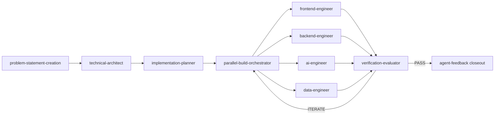

# Harness Architecture

> The **AI Coding Agent Harness** — how the system is designed and how its parts interact.
> This documents the *harness itself*, not any project it builds. Project docs live in top-level `docs/`;
> the deeper memory-engine design is in [memory-architecture.md](memory-architecture.md).

## Overview
The harness turns VS Code + GitHub Copilot into a repeatable software-delivery pipeline:
**problem statement → architecture → plan → parallel build → verification → documentation**, wrapped
by a **self-learning memory loop** that improves the agents over time. Every stage is a dedicated
agent; the build fans out to specialist lanes; a generator-evaluator loop scores each iteration until
it meets an acceptance bar.

## Components

| Area | Path | Responsibility |
| --- | --- | --- |
| Agents | [.github/agents/](../agents/) | Role-specialized Copilot personas (one per pipeline stage + lanes + feedback) |
| Skills | [.github/skills/](../skills/) | Reusable workflows agents invoke (TDD, parallel-build, verification-loop, doc-governance, anti-patterns) |
| Instructions | [.github/instructions/](../instructions/) | Path-scoped rules (coding-style, architecture defaults, memory) applied by `applyTo` |
| Memory store | [.github/memory/](../memory/) | Durable records: `schema.yaml`, `policy.yaml`, `repo/*.yaml` (committed, team-shared) |
| Memory lib | [.github/lib/memory/](../lib/memory/) | `fingerprint.py` — stable solution identity for memory scope |
| Scripts | [.github/scripts/](../scripts/) | `sync-memory.py` (materialize), `run-benchmarks.ps1` (measure), `render-diagrams.ps1` |
| Benchmarks | [benchmarks/](../../benchmarks/) | Deterministic scorers (`check-build.py`, quality gates, `efficiency-tracker.py`) + tasks |
| Working area | [gan-harness/](../../gan-harness/) | Generator-evaluator scratch: feedback ledgers, run logs, reports, efficiency log |
| Landing zones | `src/`, `tests/`, `output/`, `infra/`, top-level `docs/` | Where the **built project** (not the harness) is written |

## Pipeline flow

- **Delegation, not impersonation** — the orchestrator invokes each stage as a subagent (`runSubagent`),
  so stages run in isolation and lanes run in parallel (see the harness policy in [AGENTS.md](../../AGENTS.md)).
- **Approval checkpoints** — the `technical-architect` (design) and `implementation-planner` (plan) pause
  for explicit user approval before coding begins.
- **Generator-evaluator loop** — `parallel-build-orchestrator` generates; `verification-evaluator` scores
  against the plan's rubric and returns `ITERATE` or `PASS`.

## Self-learning memory loop
On a `PASS`, `verification-evaluator` runs the `agent-feedback` **closeout**, which autonomously mints
**candidate memory records** (from deviations *and* agent self-improvements) into
`gan-harness/feedback/ledger.jsonl`. A human promotes accepted candidates into `.github/memory/repo/*.yaml`;
`sync-memory.py` **materializes** them (conflict-resolve → TTL revalidate → LRU evict → rank/cap) into
`.github/instructions/memory-repo.instructions.md`, which the agents **recall** on the next build.
Full design: [memory-architecture.md](memory-architecture.md).

## Measurement
`benchmarks/scripts/check-build.py` scores a build 0–10 (presence, syntax, verified tests, src-only
modularity + duplication). `efficiency-tracker.py` logs per-build quality, iterations-to-PASS, memory
count, and tokens (auto-read from the VS Code debug log) to `gan-harness/efficiency-log.csv` so the
harness's improvement is a visible trend. See [evaluation.md](evaluation.md) and [observability.md](observability.md).

## Design principles
- **Human-in-the-loop** — no infra execution, no destructive ops, promotion is human-approved.
- **Microsoft/Azure-native by default** — overridable by the problem/design/spec.
- **Minimal-change / cleanup-first** — extend in place; no parallel subsystems.
- **Deterministic where it matters** — scorers and memory materialization are Python, not model calls.
