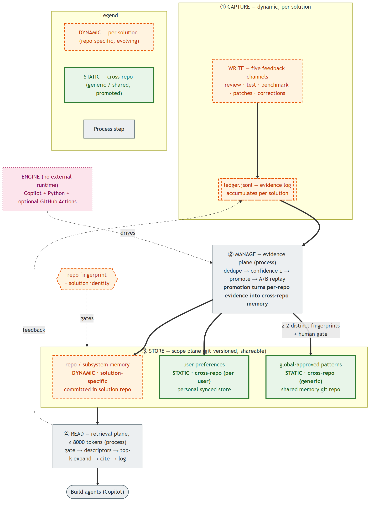
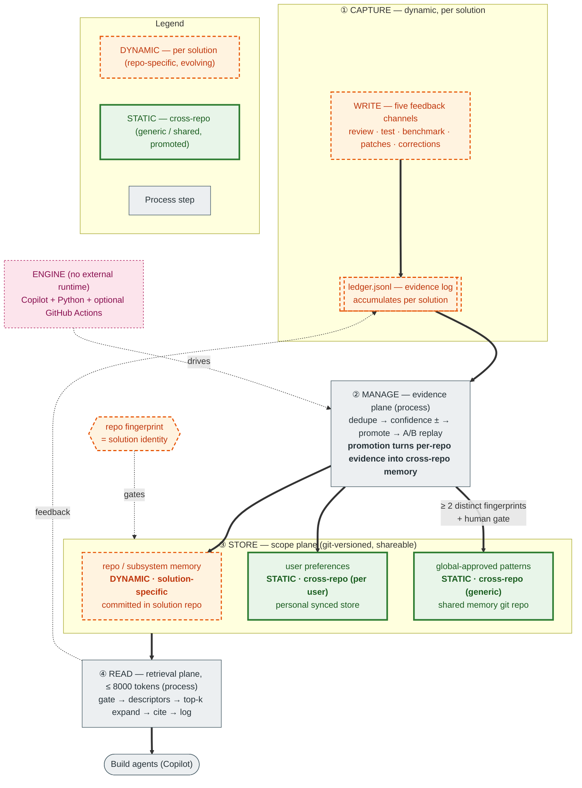
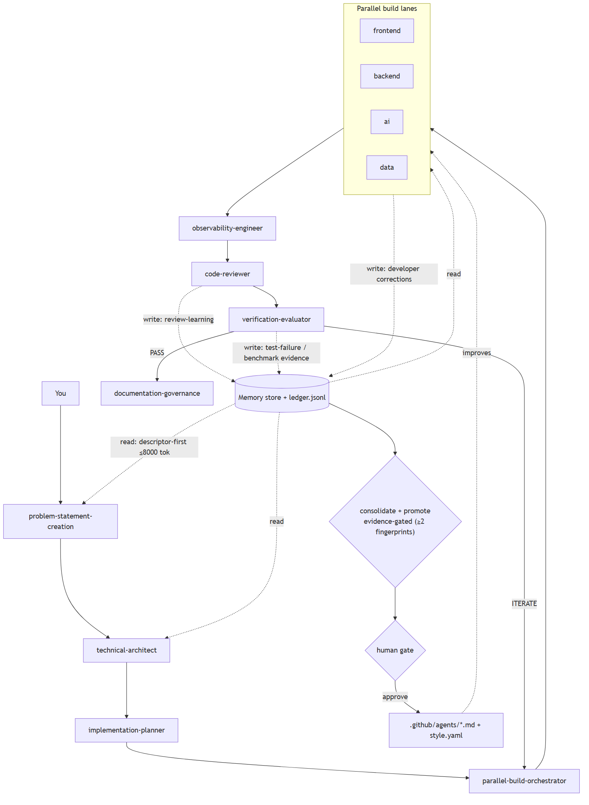
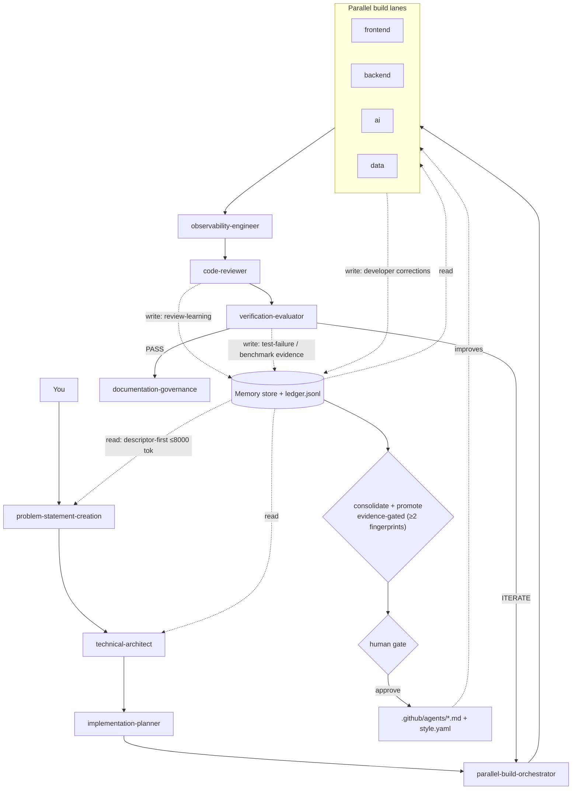
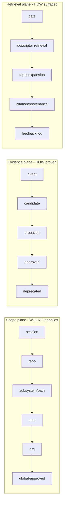
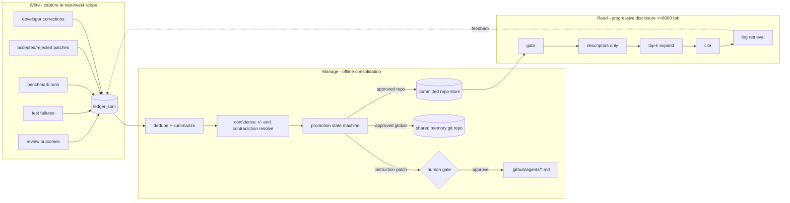

# Memory & Self-Learning Architecture

> Final design for the harness memory store and self-learning loop. Primary objective:
> **maximize token efficiency without dropping code quality** — no duplicated or redundant
> memory logic, minimal cyclomatic complexity per block, auditable retrieval, and evidence-gated
> promotion. This document is the design reference consumed by `IMPLEMENTATIONPLAN.md` (same folder).

## 0. Diagrams

**Memory implementation — the write → manage → read loop across the three planes:**



<details><summary>Mermaid source (fallback)</summary>



</details>

**Harness workflow — the pipeline with the self-learning loop wrapped around it:**



<details><summary>Mermaid source (fallback)</summary>



</details>

> Regenerate PNGs with `powershell -ExecutionPolicy Bypass -File .github/scripts/render-diagrams.ps1` after
> editing the `.mmd` sources under `.github/docs/diagrams/`.

## 1. Purpose

The harness governs GitHub Copilot with a **Copilot/Python-native** memory system — no external agent
runtime required. This document replaces the flat `Tier A / B / C` memory model with a design that
separates three orthogonal concerns so one repository's assumptions cannot silently poison another,
retrieval stays within a hard token budget, and memory quality is measurable through review, test,
and benchmark feedback.

**Engine vs store (foundational principle).** The *engine* — capture, consolidation, evidence-gated
promotion, and scoring — runs on what you already have: **GitHub Copilot** drives the interactive loop
(its agents capture corrections, review, and score), **Python** runs the deterministic parts (quality
checks, materialization, baseline compare), and **GitHub Actions** (optional) runs them unattended on a
schedule. There is **no external agent runtime and no machine-local memory store**. Durable memory
lives entirely in **git-versioned files**: committed at repo scope and published to a shared memory git
repo at global scope, then materialized into committed `.github/instructions/**` that Copilot reads
directly. A fresh clone or teammate gets the same memory with nothing to install. To keep delivery
token-efficient, materialized memory is path-scoped via `applyTo` (loaded only for relevant files, not
always-on) and descriptor-dense.

## 2. Core principle — three orthogonal planes

The previous `Tier A/B/C` model conflated *scope* (where a memory applies), *evidence* (how proven it
is), and *lifecycle/retrieval* (how it is surfaced). The final design separates them:



A memory's scope, evidence state, and retrieval treatment are independent fields on a single record.

## 3. Locked design decisions (resolved conflicts)

| # | Decision | Consequence |
| --- | --- | --- |
| D1 | Phase state lives in a versioned manifest, never by overwriting `.github/copilot-instructions.md` | Only `approved` evidence may patch instruction files, through the human gate |
| D2 | Corrections are captured instantly at repo/user scope; global promotion requires evidence across ≥2 distinct solution fingerprints + A/B replay | Instant capture is not instant global promotion |
| D3 | User preferences are a distinct scope with provenance; repo/subsystem scope wins on conflict | No flat global style dump |
| D4 | Retrieval is descriptor-first progressive disclosure with citation, not fixed tiny reads | Token control without brittleness |

## 4. Design guardrails (primary objective, made structural)

- **One record schema, one ledger writer** — every channel writes the same shape. No competing formats.
- **Scope is a field, not a separate store** — no parallel per-scope code paths.
- **Pure, low-complexity functions** — scope resolution and retrieval are pure staged functions, each
  single responsibility, target **cyclomatic complexity ≤ 8** and **≤ 25 lines**, enforced by the
  existing [check-complexity.py](../../benchmarks/scripts/check-complexity.py) and
  [check-loc.py](../../benchmarks/scripts/check-loc.py). Reuse those scripts; do not add new ones.
- **Descriptor-first retrieval + hard 8000-token cap + hash-ref for unchanged instructions** — the
  token-budget policy in [.github/memory/policy.yaml](../memory/policy.yaml) governs the read path.
- **On-demand skills over always-on tables** — the standing anti-pattern table becomes matched on
  demand to reduce standing token load.
- **Duplication budget** — memory modules are gated by
  [check-duplication.py](../../benchmarks/scripts/check-duplication.py) at the existing 0.05 ratio.

## 5. Memory store (state)

### 5.1 Record schema

One record shape, differentiated only by `scope.level` and `type`:

```yaml
id: mem-2026-0342
type: preference | convention | pattern | test-failure | review-learning | skill-ref
scope:
  level: repo                 # session | repo | subsystem | user | org | global
  repo_fingerprint: <sha256>  # remote-url + repo marker, NOT a folder path
  path_glob: "src/analytics/**"   # subsystem scope only
  user_id: null               # user-preference scope only
descriptor: "Use named exports, not default exports"   # cheap; retrieved first
content: "..."                # full text; expanded only on top-k hit
evidence:
  state: probation            # event | candidate | probation | approved | deprecated
  occurrences: 2
  sources: [session:abc, run:BM-09-0031]   # >=2 independent required to promote
  ab_replay: pending          # required before approved
confidence: 0.62              # rises on repeated success, falls on contradiction/rejection
version: 3
supersedes: mem-2026-0221
lifecycle: {created: 2026-08-01, ttl_days: 30, status: active}
privacy: {redacted: true, classification: none}
```

### 5.2 Storage layout — engine vs shareable stores

**The engine is Copilot + Python + (optional) GitHub Actions. Durable, shareable memory lives in
git-versioned files — nothing is machine-local or trapped in an external runtime.**

| Tier | Lives in | Shareable? |
| --- | --- | --- |
| Session / working | Copilot chat session (ephemeral) | No — volatile, per-session |
| Repo / subsystem | Committed in the solution repo: `.github/instructions/**` (`applyTo`), `AGENTS.md`, `.github/memory/repo/*.yaml` | Yes — team-shared via git; travels with every clone |
| User preferences | Personal synced store (user dotfiles / profile git) + repo override file | Yes — across the user's machines; personal |
| Global-approved (generic) | **Shared memory git repo** (versioned, team/org-wide) referenced by every solution | Yes — cross-repo and cross-team; the portable tier |
| Engine (capture / consolidate / promote / score) | Copilot (interactive) + Python (deterministic) + GitHub Actions (optional schedule) | n/a — runtime, not data |

Committed / shareable layout (per solution):

```
.github/memory/
  schema.yaml                 # THE single record schema (source of truth)
  policy.yaml                 # token-budget + confidence/TTL policy (consumed by the Python loop)
  global.lock                 # pinned ref/version of the shared global memory store
  repo-id                     # committed solution identity (fingerprint seed)
  repo/
    conventions.yaml          # repo-scoped approved memory (committed, team-shared)
    style.yaml                # repo style overrides — beats user preferences
gan-harness/feedback/ledger.jsonl   # episodic evidence log (per solution)
.github/instructions/**             # materialized memory Copilot actually reads
```

Shared global memory store (separate git repo, referenced by every solution):

```
memory-global/
  patterns/*.yaml               # global-approved generic memory (evidence + provenance)
```

Volatile / personal (NOT committed):

```
Copilot chat session            # ephemeral working context
<user dotfiles / profile git>   # optional personal preferences store
```

**Delivery to Copilot.** Copilot reads committed files directly. The applicable repo-scoped and
global-approved memory is materialized (by `.github/scripts/sync-memory.py`) into committed
`.github/instructions/**` and `style.yaml`; global promotions are gated by human PR review, and each
solution pulls the pinned global store via `global.lock`. Memory is portable and team-shareable with
no runtime dependency.

### 5.3 Repo fingerprint & scope resolution

**Fingerprint = solution identity.** `repo_fingerprint` identifies the *solution*, not the folder or a
single remote, so it survives clone, rename, folder moves, remote renames, and org transfers. It is
derived deterministically by this precedence, which handles multi-remote and no-remote repos:

1. **Committed solution id** — if `.github/memory/repo-id` exists, `repo_fingerprint = sha256(repo-id)`.
2. **Canonical remote** — else derive from remotes: prefer `origin`; if absent, the lexicographically
   smallest normalized remote URL (strip protocol/credentials/trailing `.git`, lowercase host). Seed
   `.github/memory/repo-id` with it on first run so later remote changes do not shift identity.
3. **No remote** — else generate a UUID and write it to `.github/memory/repo-id`.

**Generic vs solution-specific applicability.** Scope — not blanket fingerprint matching — decides
where a memory applies:

| Scope | Applies where | Fingerprint role |
| --- | --- | --- |
| repo / subsystem | this solution only (solution-specific) | injected only when `repo_fingerprint` equals the current solution |
| user | this user, across solutions | applies across repos; repo/subsystem overrides on conflict |
| global-approved | all solutions (generic) | not equality-gated; promoted only after evidence spans **≥2 distinct** solution fingerprints, proving cross-repo generality |

On conflict, precedence is `subsystem > repo > user > global`. The model never sets its own scope; the
loop assigns scope from the emitting channel and context, and promotion to global is gated on distinct
cross-solution evidence plus the human gate.

## 6. Self-learning loop (behavior)



### 6.1 Feedback channels (five write into one ledger)

| Channel | Emitter | Record type | Initial scope | Promotion evidence |
| --- | --- | --- | --- | --- |
| Review outcomes | [code-reviewer](../agents/code-reviewer.agent.md) | review-learning | repo | accepted-patch proof |
| Test failures | [verification-evaluator](../agents/verification-evaluator.agent.md) | test-failure | subsystem | fix verified (signature + cause + fix + validation cmd stored) |
| Benchmark runs | [run-benchmarks.ps1](../scripts/run-benchmarks.ps1) | benchmark-evidence | repo | pass rate up / token cost down / no regression |
| Accepted/rejected patches | [coding-agent ledger](../../gan-harness/feedback/agents/coding-agent.md) | patch-outcome | repo | confidence adjustment |
| Developer corrections | build agents (new capture step) | preference/correction | repo/user | high priority; global only if repeated cross-repo |

### 6.2 Promotion state machine

`event → candidate` (1 occurrence) → `probation` (≥2 independent sources) → `approved` (A/B replay
shows pass rate up or token cost down with no regression, plus human approval for global scope or any
instruction-file edit) → `deprecated` (contradiction, supersede, or staleness TTL). This unifies the
former standing anti-pattern table and the agent-feedback ledger into one pipeline.

### 6.3 Retrieval pipeline

Pure staged functions, each cheap and single-responsibility:

1. **Gate** — is any memory relevant to the current objective/path?
2. **Descriptor retrieval** — pull only `descriptor` strings.
3. **Top-k expansion** — expand `content` for the top 3–5 by
   `relevance × confidence × freshness × success_impact` within the 8000-token cap.
4. **Citation** — attach `id` + provenance so injection is auditable.
5. **Feedback log** — record what was retrieved, used, and ignored; feed back into the ledger.

## 7. Post-change harness shape

- `Tier A/B/C` retired; replaced by scope + evidence + retrieval planes on one schema.
- Two ledgers collapse into one `ledger.jsonl` source plus generated per-agent markdown views.
- Benchmark runner repaired and isolated; it is the evidence engine for promotion.
- Retrieval is auditable; every injection carries `id` + provenance and is logged.
- Repo-scoped `style.yaml` is in every build agent's read order; user preferences sync via a personal
  store and are overridden by repo scope.
- **Memory is shareable and runtime-free.** Repo memory is committed in the solution; global-approved
  memory lives in a shared memory git repo pinned via `global.lock`; both are materialized into
  committed `.github/instructions/**` that Copilot reads. The engine is Copilot + Python; no external
  agent runtime is required.
- Build agents gain an output contract (no preamble; diff/patch-only in edit mode) and a
  correction-capture step.
- New memory code is gated by the existing complexity, LOC, and duplication scripts.
- **Context exclusions are artifact-safe.** Index/search exclusions target only regenerable bulk
  (`node_modules`, `__pycache__`, `.venv`, `dist`, `target`, `.git`, `gan-harness/runs/`, logs).
  Artifact/source directories (`output/`, `src/`, `tests/`, `infra/`, `.github/docs/`,
  `gan-harness/feedback/`, `.github/`, `.github/memory/`) are never excluded, and content-exclusion
  (`.copilotignore`) is not used over artifacts — so fixes and backtracking loops always retain
  full read/edit access. Token savings come from the retrieval plane (§6.3), not from hiding files.

## 8. Governance

- **Privacy** — redact secrets, tokens, and raw payloads before any episodic write.
- **Human control** — global promotions and instruction-file patches require explicit approval.
- **Versioning** — records supersede/deprecate rather than mutate silently.
- **Lifecycle** — stale entries (past `ttl_days`) are archived or revalidated, not blindly reused.
- **Observability** — read/write/update/delete operations are logged and replayable.

## 9. Evaluation

Memory quality is validated by benchmarks that test recall, usefulness, contamination (cross-repo
leak), staleness, and token cost. This extends the current recall-only
[BM-06](../../benchmarks/tasks/BM-06-memory-recall.yaml) task.

## 10. Traceability

Implementation tasks, sequencing, file-level change map, and the acceptance rubric that gates this
design are maintained in `IMPLEMENTATIONPLAN.md` (this folder).
