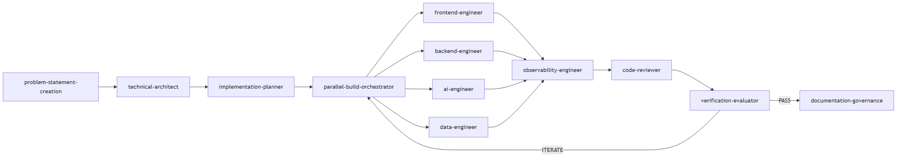
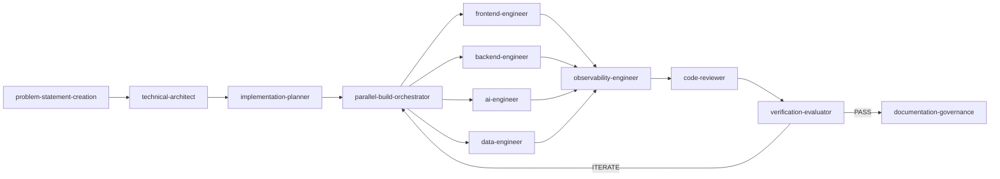
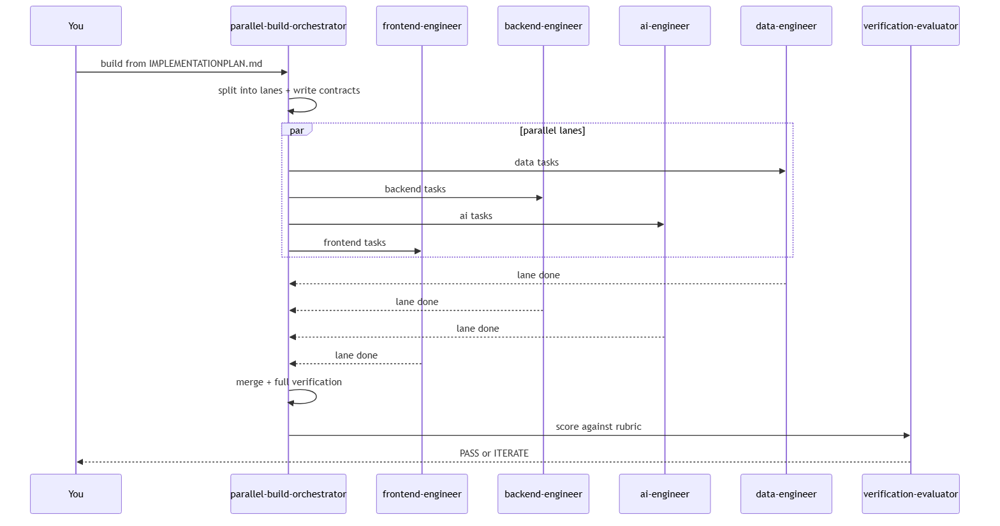
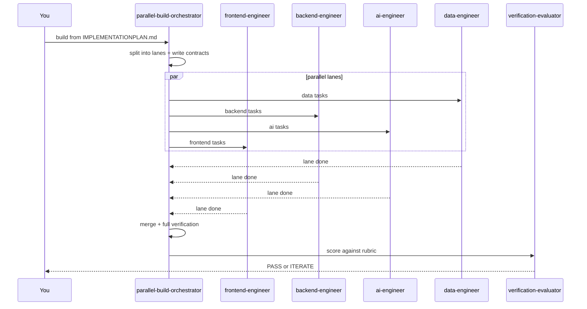

# AI Coding Agent Harness

The **AI Coding Agent Harness** is an end-to-end, multi-agent system that takes a software project
from a raw problem statement all the way to verified, documented code — **problem statement →
architecture → plan → parallel build → verification → documentation**. It is built for developers
and architects who want AI coding agents to do real engineering work under guardrails, not just
autocomplete snippets.

### What it is

A set of purpose-built **agents** (in [.github/agents/](.github/agents/)), reusable **skills**
(in [.github/skills/](.github/skills/)), and path-scoped **instructions**
(in [.github/instructions/](.github/instructions/)) that turn VS Code + GitHub Copilot into a
repeatable software-delivery pipeline. Each stage of the pipeline has a dedicated agent, work
**fans out** to specialist build lanes that run in parallel, and a **generator-evaluator loop**
scores every iteration until it meets an acceptance bar.

### What it does

- **Captures the problem** as a strict, fact-only `PROBLEMSTATEMENT.md` (optionally grounded in
  Microsoft 365 context via WorkIQ).
- **Designs the solution** as a Microsoft/Azure-first `DESIGN.md` plus a `TechnicalGaps.md`.
- **Plans the build** as a sequenced `IMPLEMENTATIONPLAN.md` with lanes, a file-level change map,
  and a weighted acceptance rubric.
- **Builds in parallel** across frontend, backend, AI, and data lanes with non-overlapping file
  ownership and explicit interface contracts (or a single `coding-agent` for small changes).
- **Verifies and scores** the result test-first (build, test, lint, typecheck) and iterates against
  the rubric until it passes.
- **Governs documentation** so the whole system stays onboarding-ready and self-describing.

### Who it's for

Developers and solution architects setting up a repository for AI coding agents, following the
"Setting Up your repo for AI Coding Agents" guidance. Every agent is **human-in-the-loop**, prefers
**Microsoft/Azure-native** services, and never deploys or runs destructive operations on its own.

### Core concepts

| Concept | What it means here |
| --- | --- |
| **Agent** | A role-specialized Copilot persona (problem, design, plan, build lanes, review, eval, docs). |
| **Skill** | A reusable workflow an agent invokes (TDD, parallel-build, verification loop, doc governance). |
| **Lane** | A build workstream (frontend / backend / AI / data) that owns disjoint files. |
| **Contract** | An interface (API/schema/event/type) lanes code against instead of each other. |
| **Generator-evaluator loop** | The build agent generates; the evaluator scores against the rubric and returns `ITERATE` or `PASS`. |

## Pipeline overview

This repo is a problem-statement → design → coding agent harness. Each lane has a
dedicated agent, and a generator-evaluator loop verifies the build.

### Pipeline



<details><summary>Diagram source (Mermaid)</summary>



</details>

The coding stage **fans out** into specialist lanes that build in parallel, then **fans in**
for a single review + verification pass. For a small or single-domain change you can skip the
orchestrator and use the single `coding-agent` instead.

### Agents

| Agent | File | Produces / Purpose |
| --- | --- | --- |
| Problem Statement | [.github/agents/problem-statement-creation.md](.github/agents/problem-statement-creation.md) | `PROBLEMSTATEMENT.md` (fact-only) |
| Technical Architect | [.github/agents/technical-architect.agent.md](.github/agents/technical-architect.agent.md) | `DESIGN.md`, `TechnicalGaps.md` |
| Implementation Planner | [.github/agents/implementation-planner.agent.md](.github/agents/implementation-planner.agent.md) | `IMPLEMENTATIONPLAN.md` (tasks + lanes + acceptance rubric) |
| Parallel Build Orchestrator | [.github/agents/parallel-build-orchestrator.agent.md](.github/agents/parallel-build-orchestrator.agent.md) | Splits plan into lanes, contracts, merges + verifies |
| Frontend Engineer (UI lane) | [.github/agents/frontend-engineer.agent.md](.github/agents/frontend-engineer.agent.md) | UI/components/client, test-first |
| Backend Engineer (backend lane) | [.github/agents/backend-engineer.agent.md](.github/agents/backend-engineer.agent.md) | APIs/services/auth, test-first |
| AI Engineer (AI lane) | [.github/agents/ai-engineer.agent.md](.github/agents/ai-engineer.agent.md) | Model integration/prompts/RAG, test-first |
| Data Engineer (data lane) | [.github/agents/data-engineer.agent.md](.github/agents/data-engineer.agent.md) | Schemas/pipelines/migrations, test-first |
| Observability Engineer (cross-cutting) | [.github/agents/observability-engineer.agent.md](.github/agents/observability-engineer.agent.md) | Logging/metrics/traces/health/alerts at fan-in |
| Coding Agent (single-lane Generator) | [.github/agents/coding-agent.agent.md](.github/agents/coding-agent.agent.md) | Test-first implementation when not parallelizing |
| Code Reviewer | [.github/agents/code-reviewer.agent.md](.github/agents/code-reviewer.agent.md) | Severity-ranked review, PASS / CHANGES REQUIRED |
| Verification Evaluator | [.github/agents/verification-evaluator.agent.md](.github/agents/verification-evaluator.agent.md) | Rubric scoring + iteration feedback |
| Agent Feedback (retrospective) | [.github/agents/agent-feedback.agent.md](.github/agents/agent-feedback.agent.md) | Compares an agent's spec vs its session behavior; logs deviations + proposes spec improvements |
| Documentation Governance | [AGENTS.md](AGENTS.md) | Enterprise-standard, onboarding-ready docs |

### Skills

| Skill | File | Use for |
| --- | --- | --- |
| documentation-governance | [.github/skills/documentation-governance/SKILL.md](.github/skills/documentation-governance/SKILL.md) | System/module docs to standard |
| implementation-planning | [.github/skills/implementation-planning/SKILL.md](.github/skills/implementation-planning/SKILL.md) | Design → sequenced plan |
| parallel-build | [.github/skills/parallel-build/SKILL.md](.github/skills/parallel-build/SKILL.md) | Split work into parallel lanes with contracts |
| observability | [.github/skills/observability/SKILL.md](.github/skills/observability/SKILL.md) | Logs/metrics/traces/health/alerts at boundaries |
| tdd-workflow | [.github/skills/tdd-workflow/SKILL.md](.github/skills/tdd-workflow/SKILL.md) | Red-green-refactor implementation |
| code-review | [.github/skills/code-review/SKILL.md](.github/skills/code-review/SKILL.md) | Review a diff/PR/task |
| verification-loop | [.github/skills/verification-loop/SKILL.md](.github/skills/verification-loop/SKILL.md) | Build/test/lint/typecheck + rubric scoring |
| search-first | [.github/skills/search-first/SKILL.md](.github/skills/search-first/SKILL.md) | Research before coding |

### Parallel build (fan-out / fan-in)

The `parallel-build-orchestrator` splits an approved `IMPLEMENTATIONPLAN.md` into lanes
(frontend, backend, AI, data) that touch **disjoint files**, defines interface contracts under
`gan-harness/contracts/`, and dispatches each lane to its specialist. Lanes build concurrently
(prefer one git branch/worktree per lane), then the orchestrator merges them, runs the full
verification loop once, and hands the integrated result to review + evaluation. One file has
exactly one owning lane; lanes coordinate only through contracts.

### Generator-evaluator loop

The specialist generators (or single `coding-agent`) and `verification-evaluator` form an
iterative loop. The evaluator scores each iteration against the weighted acceptance
rubric in `IMPLEMENTATIONPLAN.md`, writes `gan-harness/feedback/feedback-<NNN>.md`,
and returns `ITERATE` or `PASS`. The build addresses feedback each round until
the pass threshold (default 7.0/10) is met, then a final `gan-harness/build-report.md`
is written.

After a solution reaches `PASS`, run the `agent-feedback` retrospective in solution-closeout mode.
That closeout reviews the session transcript and session history for each participating harness
agent, appends evidence-backed entries to `gan-harness/feedback/agents/<agent>.md`, and then applies
curated spec updates only when the closeout run was explicitly approved to do so.

Repo-wide Copilot behavior is defined in
[.github/copilot-instructions.md](.github/copilot-instructions.md).

### Kickstart artifacts (start a new project)

All starter templates live in [templates/](templates/). Each agent consumes or produces a
pipeline artifact. Copy the matching template to the canonical name (drop `.template` and
place it where the agent reads it), fill in the `TODO: Add details`, then run the agent.

| Step | Agent | Copy template → canonical file |
| --- | --- | --- |
| 1 | problem-statement-creation | [templates/PROBLEMSTATEMENT.template.md](templates/PROBLEMSTATEMENT.template.md) → `output/PROBLEMSTATEMENT.md` |
| 2 | technical-architect | [templates/DESIGN.template.md](templates/DESIGN.template.md) → `output/DESIGN.md`, [templates/TechnicalGaps.template.md](templates/TechnicalGaps.template.md) → `output/TechnicalGaps.md` |
| 3 | implementation-planner | [templates/IMPLEMENTATIONPLAN.template.md](templates/IMPLEMENTATIONPLAN.template.md) → `output/IMPLEMENTATIONPLAN.md` |
| 4 | coding-agent | implements tasks in `output/IMPLEMENTATIONPLAN.md` under `src/` + `tests/` |
| 5 | verification-evaluator | [templates/feedback-000.template.md](templates/feedback-000.template.md) → `gan-harness/feedback/feedback-001.md` |
| done | verification-evaluator | [templates/build-report.template.md](templates/build-report.template.md) → `gan-harness/build-report.md` |

> Harness deliverables live in [`output/`](output/) (`PROBLEMSTATEMENT.md`, `DESIGN.md`, `TechnicalGaps.md`,
> `IMPLEMENTATIONPLAN.md`) so the repo root stays clean. Templates in [`templates/`](templates/) are the
> committed sources and are never overwritten when an agent regenerates an artifact.

## How to Run the Harness

### Prerequisites

| Requirement | Needed for | Notes |
| --- | --- | --- |
| VS Code + GitHub Copilot (agent mode) | All agents | Agents are selected from the Chat **Agent** picker. |
| Node.js 18+ | Diagram rendering | `scripts/render-diagrams.ps1` uses `npx @mermaid-js/mermaid-cli`. |
| **WorkIQ plugin** | `problem-statement-creation` only | Pulls Microsoft 365 context (emails, meetings, Teams, SharePoint). Sign in once; accept the EULA on first use. |

#### Install the WorkIQ plugin (if not already available)

WorkIQ is a GitHub Copilot plugin. It is required only by the `problem-statement-creation` agent;
the rest of the harness works without it.

**Verify it's available first** — in Copilot Chat, ask any workplace question (e.g. _"What meetings
do I have today?"_). If WorkIQ is installed, the agent answers via the `ask_work_iq` tool. If you get
_"I don't have access to emails/meetings"_, install it:

**VS Code Copilot Chat**
1. Open the Copilot **Chat** view → **…** menu → **Plugins** (or the Copilot plugin marketplace).
2. Search for **WorkIQ** and install it.
3. Reload VS Code. Confirm the `workiq` skill / `ask_work_iq` tool now appears in the tool picker.

**GitHub Copilot CLI**
1. Ensure the Copilot CLI is installed and you are signed in (`copilot --version`).
2. Install the WorkIQ plugin from the Copilot plugin marketplace (search **WorkIQ**).
3. Verify it landed under `~/.copilot/installed-plugins/copilot-plugins/workiq/`.

> First run prompts a one-time **EULA acceptance** and Microsoft 365 sign-in. Authentication then
> uses your connected credentials automatically. If your exact install command differs by Copilot
> version, use your client's plugin marketplace and search for "WorkIQ".

### How to trigger an agent
In VS Code Copilot Chat, open the **Agent** picker (the mode dropdown at the top of the Chat view)
and select the agent by name, or type `@` and pick it. Then send your instruction. Each agent in
the table above maps to a file under [.github/agents/](.github/agents/).

- One agent is active per chat session. To move to the next stage, switch the agent in the picker.
- Agents are human-in-the-loop: they pause at approval checkpoints and never deploy or run
  destructive operations.
- Skills (under [.github/skills/](.github/skills/)) are invoked automatically by the relevant agent,
  or you can reference one by name to force its workflow.

### Sample prompts to start each agent

Select the agent in the picker, then paste the matching prompt (replace the `<...>` placeholders).

**1. `problem-statement-creation`** — requires the WorkIQ plugin
```text
Create a problem statement for <Customer/Project name>.
Description: <1–3 sentences on what this engagement is about>.
Sources: <input/ subfolders, meeting names, or email threads — or "none">.
```

**2. `technical-architect`**
```text
Produce the architecture from output/PROBLEMSTATEMENT.md.
Default to Microsoft/Azure-native services. Walk me through checkpoints A, B, and C.
```

**3. `implementation-planner`**
```text
Create output/IMPLEMENTATIONPLAN.md from the approved output/DESIGN.md.
Break work into frontend/backend/ai/data lanes with disjoint files and an acceptance rubric.
```

**4a. `parallel-build-orchestrator`** — parallel build
```text
Build from output/IMPLEMENTATIONPLAN.md. Split into lanes, write the interface contracts to
gan-harness/contracts/, then dispatch each lane to its specialist engineer.
```

**4b. `coding-agent`** — single-lane / small change (instead of the orchestrator)
```text
Implement task <T1> from output/IMPLEMENTATIONPLAN.md test-first. Run build, tests, lint, and typecheck before handing off.
```

**4c. Lane specialists** — run each in its **own Chat window** for true parallelism
```text
# frontend-engineer
Implement the frontend-lane tasks <T-ids> from output/IMPLEMENTATIONPLAN.md against the contracts in gan-harness/contracts/.

# backend-engineer
Implement the backend-lane tasks <T-ids> from output/IMPLEMENTATIONPLAN.md; publish/consume contracts in gan-harness/contracts/.

# ai-engineer
Implement the AI-lane tasks <T-ids> from output/IMPLEMENTATIONPLAN.md; keep generation off the critical correctness path.

# data-engineer
Implement the data-lane tasks <T-ids> from output/IMPLEMENTATIONPLAN.md; publish the schema/index contracts first.
```

**5. `observability-engineer`** — cross-cutting, run at fan-in after lanes merge
```text
Instrument the merged build per output/DESIGN.md: structured logs with a correlation id, the metrics
and traces the design requires, health checks, and alerts. Never log secrets or PII. Update docs/observability.md.
```

**6. `code-reviewer`**
```text
Review my current changes against output/IMPLEMENTATIONPLAN.md and the coding standards.
Report blockers/major/minor and give a PASS or CHANGES REQUIRED verdict.
```

**7. `verification-evaluator`**
```text
Score the implementation against the rubric in output/IMPLEMENTATIONPLAN.md.
This is iteration <N>, pass threshold 7.0. Write gan-harness/feedback/feedback-<NNN>.md.
```

**8. `documentation-governance`** (root `AGENTS.md` agent)
```text
Document the system: fill docs/ and add documentation.md to each module per the 14-section standard.
Use "TODO: Add details" where the repo doesn't yet have the information.
```

### End-to-end workflow (new customer)

| Stage | Trigger this agent | You provide | It writes | Gate before next stage |
| --- | --- | --- | --- | --- |
| 1. Problem | `problem-statement-creation` | customer name, 1–3 sentence description, source folders/meetings/emails | `output/PROBLEMSTATEMENT.md` | You confirm facts are correct |
| 2. Design | `technical-architect` | "design from output/PROBLEMSTATEMENT.md" | `output/DESIGN.md`, `output/TechnicalGaps.md` | Approve at its checkpoints A/B/C |
| 3. Plan | `implementation-planner` | "plan from the approved output/DESIGN.md" | `output/IMPLEMENTATIONPLAN.md` (tasks + **lanes** + rubric) | Approve the plan + lane split |
| 4. Build | `parallel-build-orchestrator` (or single `coding-agent`) | "build from output/IMPLEMENTATIONPLAN.md" | code under `src/` + `tests/`, contracts under `gan-harness/contracts/` | Lanes report complete |
| 5. Observe | `observability-engineer` | "instrument the merged build per output/DESIGN.md" | telemetry in `src/`, updated `docs/observability.md` | Required signals exist; no PII/secrets logged |
| 6. Review | `code-reviewer` | "review the changes" | severity-ranked findings | `PASS` (else fix and re-review) |
| 7. Verify | `verification-evaluator` | iteration number + threshold | `gan-harness/feedback/feedback-<NNN>.md` | `PASS` (≥7.0) or `ITERATE` back to stage 4 |
| 8. Document | `documentation-governance` | "document the system/module" | `docs/*` and module `documentation.md` | New engineer can onboard from docs |

> Steps 1–3 are sequential (each output is the next input). Step 4 is where work **parallelizes**;
> step 5 (observability) runs once at fan-in across the merged result.

### Parallel build — step by step

The fan-out/fan-in stage is driven by the **`parallel-build-orchestrator`**:

1. **Decompose** — trigger `parallel-build-orchestrator` with the approved `IMPLEMENTATIONPLAN.md`.
   It groups tasks into lanes (frontend, backend, AI, data) that touch **disjoint files**.
2. **Contracts first** — for every cross-lane dependency it writes an interface contract
   (API shape, schema, event, type) to `gan-harness/contracts/<name>.md`. Lanes code against the
   contract, never against each other. Typical order: **data → backend/ai → frontend**.
3. **Isolate** — it creates one git branch/worktree per lane (`lane/frontend`, `lane/backend`,
   `lane/ai`, `lane/data`).
4. **Fan out (parallel)** — dispatch each lane to its specialist. For true concurrency, run each
   specialist in its **own Chat session/window** so they progress at the same time:
   - `frontend-engineer` → UI lane tasks
   - `backend-engineer` → API/service lane tasks
   - `ai-engineer` → model/prompt/RAG lane tasks
   - `data-engineer` → schema/pipeline lane tasks

   Each specialist works test-first, owns only its lane's files, and runs its own local verification.
5. **Fan in (merge + verify)** — back in the orchestrator session, it integrates the lanes against
   the contracts, resolves boundary conflicts (it owns `shared` files), and runs the full
   verification loop once.
6. **Review + score** — hand off to `code-reviewer`, then `verification-evaluator`. On `ITERATE`,
   re-run the affected lane(s); on `PASS`, the evaluator writes `gan-harness/build-report.md`.



<details><summary>Diagram source (Mermaid)</summary>



</details>

### When to skip parallelization
For a small or single-domain change, skip the orchestrator and trigger the single `coding-agent`
directly with a task id — it runs the same TDD + verification loop without the lane/contract overhead.

### Rules that keep parallel lanes safe
- **One owner per file** — lanes never edit the same file; the orchestrator owns `shared` files.
- **Contracts are authoritative** — a lane changing a contract must notify the orchestrator before
  other lanes consume it.
- **Integrate before scoring** — the evaluator scores the merged result, never a single lane in isolation.

## Repository Structure

```
repo/
├─ .github/
│  ├─ copilot-instructions.md      # Repo-wide Copilot instructions + documentation standard
│  ├─ agents/                      # Harness agents (problem, design, plan, orchestrator, lane specialists, review, eval)
│  ├─ instructions/                # Path-scoped instructions (architecture, coding-style)
│  ├─ prompts/                     # Reusable prompts
│  └─ skills/                      # Workflow skills (docs, planning, parallel-build, TDD, review, verify, search)
├─ AGENTS.md                       # Documentation Governance agent manual
├─ docs/
│  ├─ architecture.md
│  ├─ deployment.md
│  ├─ local-setup.md
│  ├─ testing.md
│  ├─ observability.md
│  └─ evaluation.md
├─ templates/                      # Committed starter templates for harness artifacts
├─ output/                         # Generated harness deliverables (problem/design/gaps/plan)
├─ gan-harness/                    # Generator-evaluator working files (feedback, contracts, report)
├─ copilotscripts/                 # Throwaway/intermediate agent scripts (git-ignored)
├─ src/                            # Application source code
├─ tests/                          # Automated tests
├─ infra/                          # Infrastructure as Code
├─ scripts/                        # Operational/helper scripts
└─ README.md
```

## Getting Started

1. Review the system documentation under [docs/](docs/).
2. Place application code in `src/`, tests in `tests/`, infra in `infra/`, scripts in `scripts/`.
3. Each module/agent must include a `documentation.md` with the required 14 sections
   (see [AGENTS.md](AGENTS.md)).
4. Fill in every `TODO: Add details` placeholder in the `docs/` templates with
   codebase-grounded information.

## Documentation Standard

- System-level docs live in `docs/`.
- Module/agent-level docs live as `documentation.md` inside each module/agent folder.
- Never commit secrets; document only variable names and where secrets are stored.
- Use `TODO: Add details` instead of guessing.
