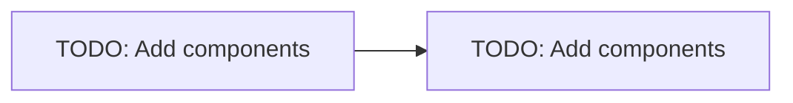

# Architecture

> Documentation governance template. Replace each `TODO: Add details` with concrete,
> codebase-grounded information. Do not remove section headings.

## Overview
TODO: Add details — what this application does and the business/functional purpose it serves.

## High-Level Architecture
TODO: Add details — major components and how they fit together.

## Component / Agent Interaction Model
TODO: Add details — how modules and agents communicate, request/response and data flows.

## End-to-End Workflow
TODO: Add details — step-by-step path of a request or job from entry to completion.

## Azure Deployment Architecture
TODO: Add details — target Azure services and runtime hosting model.

## Codebase Structure
| Path | Responsibility |
| --- | --- |
| `.github/` | Copilot instructions, agents, and skills |
| `docs/` | System-level documentation |
| `src/` | Application source code |
| `tests/` | Automated tests |
| `infra/` | Infrastructure as Code |
| `scripts/` | Operational and helper scripts |

## Failure Modes & Recovery
TODO: Add details — known failure modes and recovery guidance.

## Related Documents
- [deployment.md](deployment.md)
- [local-setup.md](local-setup.md)
- [testing.md](testing.md)
- [observability.md](observability.md)
- [evaluation.md](evaluation.md)
